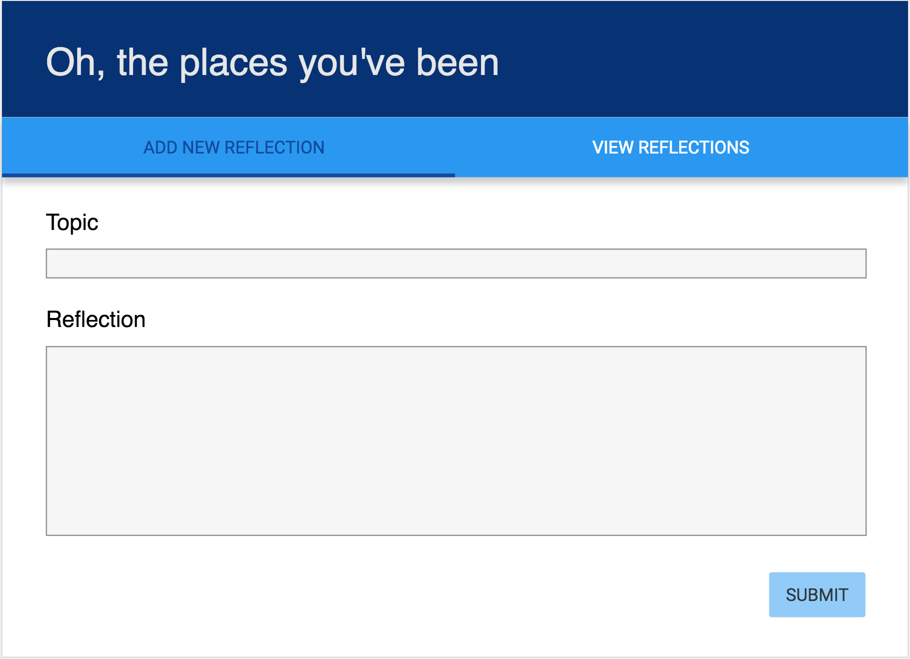
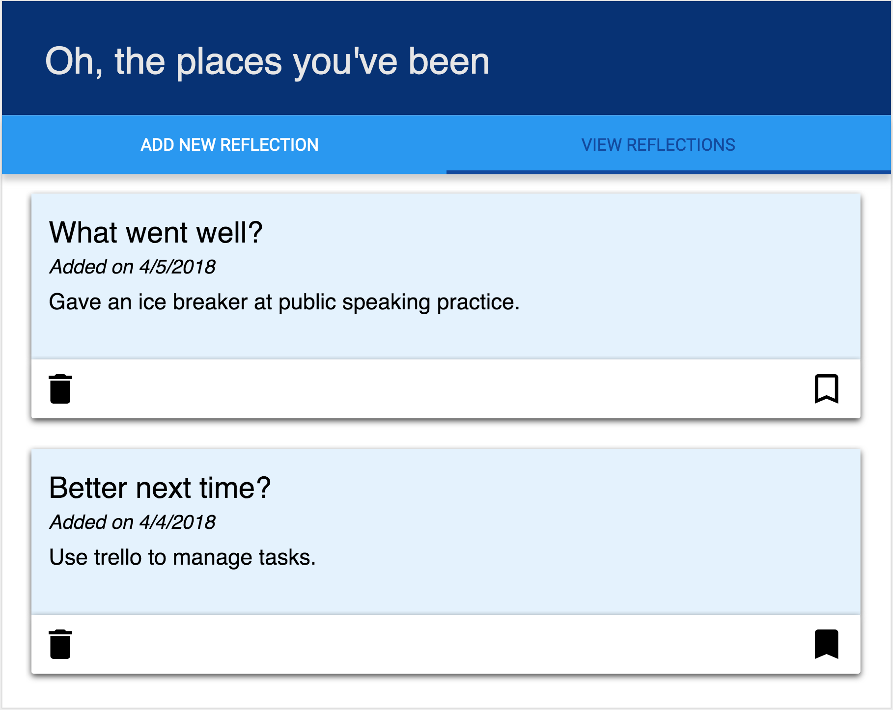

# OH, THE PLACES WE'VE BEEN


Reflection is an important part of building applications and working with a team. It's common to have a retrospective on a bi-weekly basis during a project and at the end of a project. As we approach the end of teir 2, we would like you to reflect on everthing you've accomplished. For this assignment, you will be creating a reflection board. There should be two views, one to add a reflection and another to display reflections that you've added (most recent at the top). You should also be able to remove a reflection.

### SETUP

Create your database and tables using the provided `data.sql` file. Start the server.

```
npm install
npm run server
```

Now that the server is running, open a new terminal tab with `cmd + t` and start the react client app.

```
npm run client
```

### ADD NEW REFLECTION

> NOTE: As a baseline requirement, you should use Redux to store your data. Using Sagas is a **stretch goal**.

Create a form that allows users to add a new reflection. A new reflection should be added in the database with the current date by default. 



### DISPLAY REFLECTIONS

Display a list of the existing reflections. The most recently added reflection should appear at the top of the list. Allow the user to delete existing reflections. Prompt the user to confrim prior to deleting the reflection from the database. Add a button that allows users to bookmark a reflection.



## STRETCH GOALS

- Update this README.md to describe the project in your own words
- Deploy your project to Heroku
- Improve the stying of the app using Material-UI cards, buttons, nav bar and icons
- Move your HTTP requests into sagas
- Add the ability to update an existing reflection
- Move reflection topics into a separate table and use SQL JOINs
- Allow users to include an image with the reflection using [Filestack](https://www.filestack.com/)
- Ability to filter reflections based on topic

> NOTE: These stretch goals are intended to be completed in order.